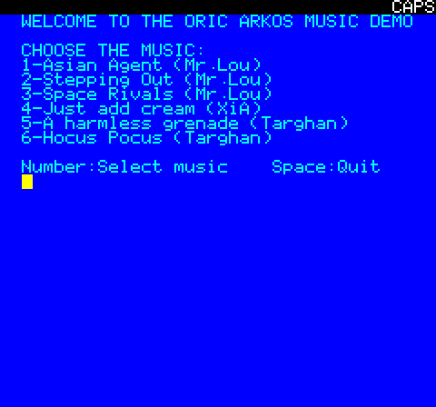
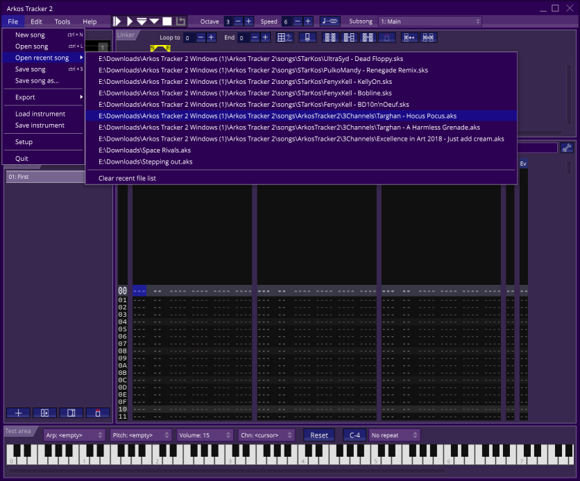
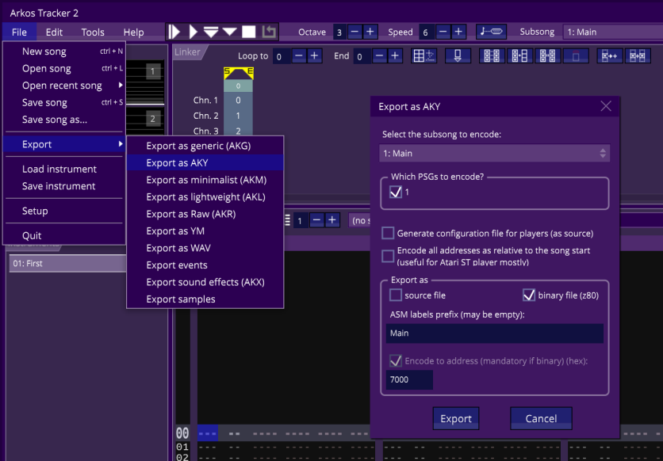

# Arkos Music Player
Sample code demonstrating how to read the keyboard without using the code from the Oric system ROM.

# How to build
This code sample requires the [Oric SDK](https://osdk.org/index.php?page=download) to build.

Just run "osdk_build.bat" to compile it, and then "osdk_execute.bat" to launch it.

# How to use
After building and running the project, you should see the following UI:

Just press any key from 1 to A to select the corresponding music.

# How to convert musics
If you want to add music to this small demo, it's not very complicated:
- Fetch the [Arkos Tracker](https://www.julien-nevo.com/arkostracker/) and unzip it.
- Launch ArkosTracker2.exe
- Load any of the songs that came with it - as long as they only have 3 channels -

- Export them to the AKY format using the following parameters:

  - Export as: Binary file (z80)
  - Encode to address: 7000
- Modify **osdk_build.bat** to add your new music by adding new entries for your music
  - Add a new **%HEADER% "data\...** entry for the song you exported (this step just adds the .tap header to the .aky file)
  - Add a new **%OSDK%\bin\taptap ren** entry as well (this step fixes the internal name on the floppy generated by tap2dsk)
  - Add one more entry to the line with **%OSDK%\bin\tap2dsk**
- Modify **main.bas** to add one more **PRINT** line to show the title

And I guess that's about it

Technically the musics could be exported to source file format, or use a differnt address, but then you will have to modify the entire system, I choose these because it was the easiest to deal with.

# Reasons
There are a few native Oric music editors, unfortunately they are not very well documented, and the music player routines require some long forgotten custom compiler magic, making them ill suited to be used in games or demos if you were not the original person who made these tools.

This is where the MYM format comes in: It allowed us to choose any of the thousands of Atari ST musics available in YM format and play them in the Oric.

# Limitations
The player is not particularly efficient, and every 256 played frames we encur a significant CPU hike, in addition to that it requires a number of temporary buffers making it also quite inneficient memory wise.

# Authors
This code is the result of a cooperation between multiple people.
- Original Amstrad CPC AKY music player by Julien Névo a.k.a. Targhan/Arkos (with some optimizations by Madram/Overlanders)
- APPLE II and Oric support by Arnaud Cocquière a.K.a GROUiK/FRENCH TOUCH
- Adaptation to the OSDK and this small Oric demo program by Mickaël Pointier (Dbug)

# Musics
The music tracks in this small demo come from the following sources:
- Arkos Tracker song folder
- https://www.indiegamemusic.com (Search music -> 8-bit platform - Chip audio -> Compatible with Oric)

# Additional information
You can find more information on the topic in various places:
- [VIA and AK-3-8912](https://wiki.defence-force.org/doku.php?id=oric:hardware:sound) on the Defence Force wiki
- [Let's make noise article](https://osdk.org/index.php?page=articles&ref=ART5) in the OSDK articles section
